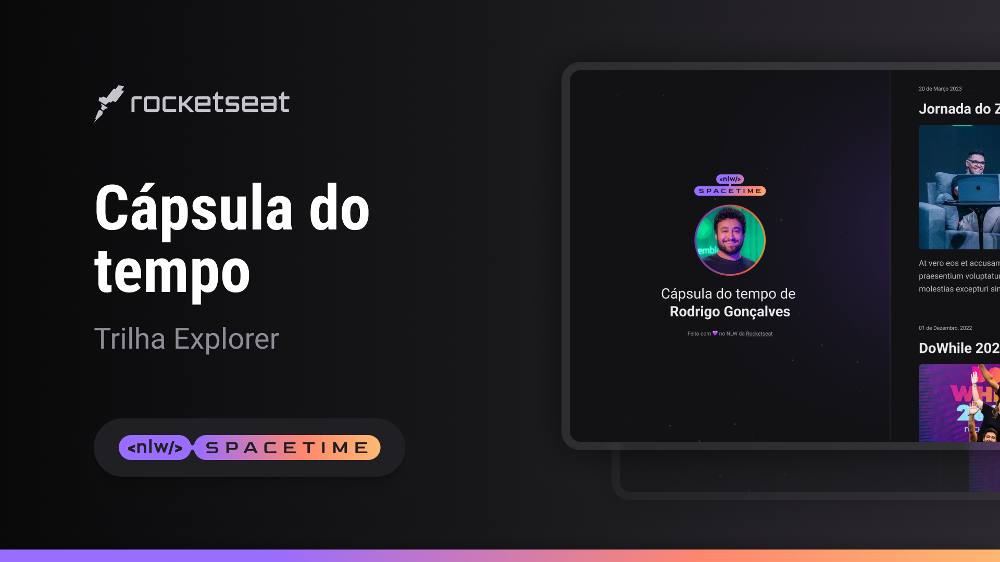

# NLW Spacetime - Aniversário RocketSeat - 6 anos

  

# Tecnologias usadas

- HTML
- CSS
- VScode
- Git
- Github

# 1ª Aula - Primeiros Passos

- Criamos a estrutura básica em HTML

# 2ª Aula - Descomplicando o código

- Iniciando a estilização usando CSS

# 3ª Aula - Estilizando nosso layout

- Aprendemos sobre o GRID LAYOUT e como ele pode ajudar a organizar os elementos na tela em linhas e colunas

# 4ª Aula - Profissionalizando o projeto

- Aprendemos sobre o WEBKIT - Como ele nos ajuda a estilizar os elementos do navegador, como a "Barra de rolagem"
- Aprendemos sobre KEYFRAMES - Como ele pode ajudar na criar animações para o site
- Aprendemos sobre RESPONSIVIDADE - Como possibilidade que nosso site funcione em tela menores

# 5ª Aula - O próximo nível

- Aprendemos em como publicar nosso site no GITHUB
